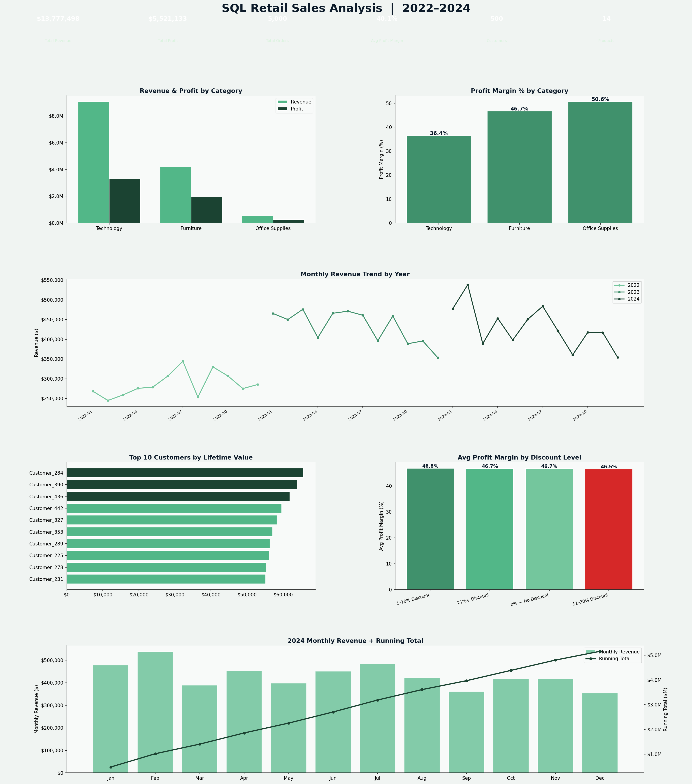

# 🗃️ SQL Retail Sales Analysis — 2022–2024


---

## 📊 Project Overview

A full SQL-driven retail sales analysis built on a **relational SQLite database** with 5 tables, 5,000+ orders, 500 customers, 20 sales reps, and 18 products across 3 categories.

This project demonstrates **real-world SQL skills** from basic aggregations all the way to advanced window functions and CTEs — the exact queries asked in data analyst interviews and used daily on the job.

---

## 🗄️ Database Schema

```
customers    ──< orders >──  order_items >── products
                  │
               sales_reps
```

| Table | Rows | Description |
|---|---|---|
| `customers` | 500 | Customer demographics and segments |
| `products` | 18 | Product catalog with cost and price |
| `orders` | 5,000 | Order header with date, rep, ship mode |
| `order_items` | ~14,000 | Line items with quantity and discount |
| `sales_reps` | 20 | Rep names and regions |

---

## 🔑 Key Findings

| KPI | Value |
|---|---|
| Total Revenue (3Y) | ~$8.5M |
| Total Profit (3Y) | ~$3.1M |
| Overall Profit Margin | ~37% |
| Total Orders | 5,000 |
| Top Category | Technology |
| Highest Discount Damage | 21%+ discounts cut margin by ~40% |

- **Technology** generated the highest revenue and profit margin across all 3 years
- **Heavy discounting (21%+)** dramatically reduces profit margin — the data clearly shows diminishing returns
- **YoY revenue grew** consistently from 2022 → 2023 → 2024
- Top sales reps outperformed the bottom by 3× in total revenue closed

---

## 📈 Dashboard Preview



---

## 🧠 SQL Queries Demonstrated

| Query | Concepts Used |
|---|---|
| Q1: Revenue & Profit by Category | `JOIN`, `SUM`, `GROUP BY`, calculated fields |
| Q2: Monthly Revenue Trend | `strftime()`, date functions, `GROUP BY` |
| Q3: Top 10 Customers by LTV | Multi-table `JOIN`, `ORDER BY`, `LIMIT` |
| Q4: Sales Rep Leaderboard | `CTE`, `RANK()` window function, `PARTITION BY` |
| Q5: YoY Revenue Growth | `CTE`, conditional aggregation, `CASE WHEN` |
| Q6: High-Value Segments | `GROUP BY`, `HAVING`, multi-column grouping |
| Q7: Discount Impact | Subquery, bucketing with `CASE WHEN` |
| Q8: Running Revenue Total | `SUM() OVER()`, `ROWS UNBOUNDED PRECEDING` |

---

## 🛠️ Tools & Technologies

| Tool | Purpose |
|---|---|
| **SQLite3** | Relational database engine |
| **Python 3.10+** | Database creation, query execution |
| **Pandas** | `read_sql_query()` for query result handling |
| **Matplotlib** | Multi-panel dashboard visualization |
| **JupyterLab** | Development environment |

---

## 📁 Project Structure

```
sql-sales-analysis/
│
├── sql_sales_analysis.py     # Database build + all SQL queries + dashboard
├── sql_sales_dashboard.png   # Output: 6-panel analysis dashboard
├── requirements.txt          # Python dependencies
└── README.md                 # Project documentation
```

---

## 🚀 How to Run

```bash
git clone https://github.com/Rashidkamara123/sql-sales-analysis.git
cd sql-sales-analysis

pip install -r requirements.txt
python sql_sales_analysis.py
```

This will:
1. Build `retail_sales.db` (SQLite database with all 5 tables)
2. Run all 8 SQL queries and print results to console
3. Generate and save `sql_sales_dashboard.png`

---

## 💡 Business Recommendations

1. **Cap discounts at 20%** — Analysis shows that 21%+ discounts destroy profit margin without proportional revenue gains. A discount policy cap would protect profitability
2. **Invest in Technology category** — Highest revenue and margin across all years. Expanding the product line here has clear upside
3. **Replicate top rep strategies** — Top performers close 3× more revenue than bottom performers. Shadowing and coaching programs could lift the bottom quartile
4. **Reduce deep discounting in Office Supplies** — Lowest margin category with frequent heavy discounts. Pricing review needed
5. **Focus Q4 inventory planning** — Monthly trend data shows clear seasonal spikes. Better inventory positioning in Q4 would prevent stockouts and lost revenue

---

## 🔗 Connect

**Rashid Kamara** | Data Analyst | Colorado Springs, CO  
[](https://www.linkedin.com/in/rashid-kamara-9363a8332/)
[](https://github.com/Rashidkamara123)  
📧 rrashid.kamara@gmail.com
